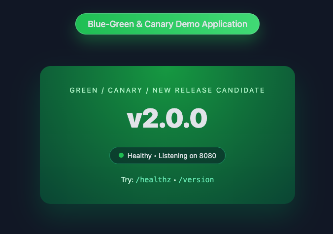

# Blue-Green-Canary-Demo-Application
Blue-Green &amp; Canary Demo Application

## Docker Build & run 


-- BLUE app (v1 – stable)

From the app-v1/ directory:

```
bala@kubelancer ~ % docker buildx build --push --platform linux/arm64,linux/amd64  --tag kubelancer/blue:v1.0.0 .

bala@kubelancer ~ % docker run -it --rm -p 8081:8080 kubelancer/blue:v1.0.0                                      
2025/11/26 04:26:01 Starting Blue-Green and Canary Demo App v1.0.0 (BLUE) on :8080

```


-- GREEN app (v2 – canary / new)

From the app-v2/ directory:

```
bala@kubelancer ~ % docker buildx build --push --platform linux/arm64,linux/amd64  --tag kubelancer/green:v2.0.0 .
docker run --rm -p 8082:8080 kubelancer/blue-green-demo-green:v2.0.0

docker buildx build --push --platform linux/arm64,linux/amd64  --tag kubelancer/green:v2.0.0 .

```

Then hit:

http://localhost:8081 → BLUE


http://localhost:8082 → GREEN




# :) Happy Computing

---

## About Me

**Balasubramani K (Bala)**  
Founder – Kubelancer Private Limited  
Cloud & DevOps Engineer (20+ years experience)

## Contact
Website: https://kubelancer.com

Cloud and DevOps Labs: https://labs.kubelancer.com

Email: bala@kubelancer.com


## I'll provide Support and Services on
- On-Demand Cloud Architect & Migration Specilist (AWS, Azure, GCP)  
- Cost Optimization  
- DevOps & CI/CD  
- Containerization, Docker, Kubernetes 
- DevSecOps
- GitOps
- Service Mesh Advisor
- Cost Optimization  
- DevSecOps  
- Monitoring & Logging  

---

== Cloud Compute and DevOps Simplified Solutions and Services ==

[^1]: Need Cloud or DevOps help? Reach out anytime.

