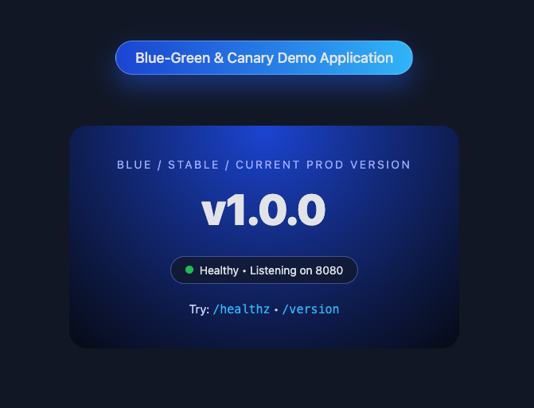

<style>{`
.lab-container {
  margin-top: 30px;
}

.lab-actions a {
  margin-right: 10px;
  padding: 10px 16px;
  border-radius: 8px;
  text-decoration: none;
  border: 1px solid #e5e7eb;
  display: inline-block;
}

.lab-actions .primary {
  background: #22c55e;
  color: white;
}

.lab-timeline {
  position: relative;
  padding-left: 40px;
  margin-top: 30px;
}

.lab-timeline::before {
  content: '';
  position: absolute;
  left: 18px;
  top: 0;
  bottom: 0;
  width: 3px;
  background: linear-gradient(to bottom, #6366f1, #22c55e);
}

.lab-step {
  position: relative;
  margin-bottom: 40px;
}

.lab-step-number {
  position: absolute;
  left: -4px;
  width: 36px;
  height: 36px;
  border-radius: 50%;
  background: linear-gradient(135deg, #6366f1, #8b5cf6);
  color: white;
  display: flex;
  align-items: center;
  justify-content: center;
  font-weight: bold;
}

.lab-card {
  margin-left: 40px;
  padding: 20px;
  border-radius: 16px;
  border: 1px solid #e5e7eb;
  background: white;
  box-shadow: 0 10px 25px rgba(0,0,0,0.05);
}

.lab-card pre {
  background: #0f172a;
  color: #e5e7eb;
  padding: 12px;
  border-radius: 10px;
}

.lab-cta {
  margin-top: 40px;
  padding: 20px;
  border-radius: 12px;
  background: #f9fafb;
  border: 1px solid #e5e7eb;
}
`}</style>

# 🚀 Blue-Green & Canary Deployment on Kubernetes

<div className="lab-actions">
  <a href="https://github.com/bakuppus/Blue-Green-Canary-Demo-Application">💻 View Code</a>
  <a href="https://github.com/bakuppus/Blue-Green-Canary-Demo-Application" className="primary">🚀 Playground</a>
</div>

---

## ⚡ Lab Quick Insight

Deploy applications using **Blue-Green and Canary strategies** to achieve:

- Zero downtime  
- Safe releases  
- Gradual traffic control  

---

## 🏗️ Architecture



---

## 🧰 Tools Used

- Kubernetes  
- kubectl  
- Docker  
- AWS / EKS  

---

## 🚀 Quick Start: Deploy in 15 Minutes

<div className="lab-timeline">

<div className="lab-step">
<div className="lab-step-number">1</div>

<div className="lab-card">

### Prerequisites

```bash
aws --version
kubectl version
docker --version

AWS:

IAM: AdministratorAccess
Configure: aws configure
</div> </div> <div className="lab-step"> <div className="lab-step-number">2</div> <div className="lab-card">
Deploy Blue Version
kubectl apply -f blue-deployment.yaml
kubectl apply -f service.yaml
</div> </div> <div className="lab-step"> <div className="lab-step-number">3</div> <div className="lab-card">
Deploy Green Version
kubectl apply -f green-deployment.yaml
</div> </div> <div className="lab-step"> <div className="lab-step-number">4</div> <div className="lab-card">
Switch Traffic
kubectl patch service my-app \
-p '{"spec":{"selector":{"version":"green"}}}'
</div> </div> <div className="lab-step"> <div className="lab-step-number">5</div> <div className="lab-card">
Canary Deployment
apiVersion: apps/v1
kind: Deployment
metadata:
  name: canary
spec:
  replicas: 1
</div> </div> </div>